### 2023.09.24

## CI/CD

### 1. CI
- Continuous Integration(지속적인 통합)
- 어플리케이션의 새로운 코드 변경 사항이 정기적으로 빌드 및 테스트 되어
공유 레포지토리에 통합
- 다수의 개발자가 버전관리툴(Git)을 공유하는 환경 

### 2. CD (Continuous Delivery & Continuous Deployment)
- 공유 레포지토리를 자동으로 빌드하는것
- CI가 새로운 소스코드의 빌드, 테스트, 병합까지를 의미하였는데, CD는 개발자의 변경 사항이 레포지토리를 넘어, 고객의 프로덕션(Production) 환경까지 릴리즈 되는 것을 의미

# 1. Github Actions(SpringBoot)
  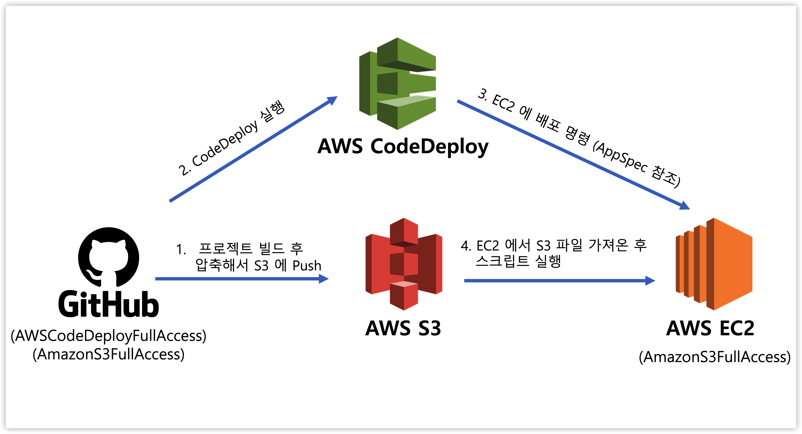


### 1. 인스턴스 생성
- AWS EC2 검색후 인스턴스시작
- 
  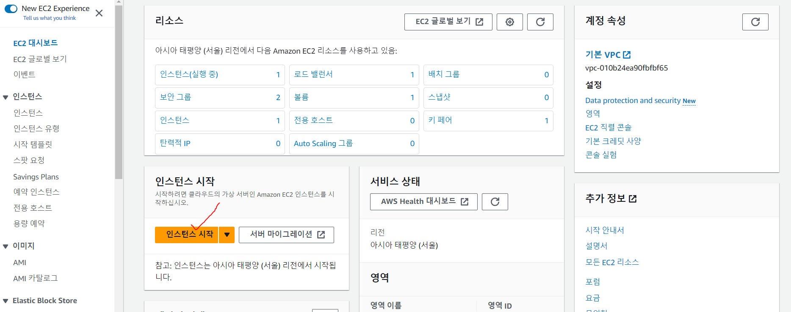
- 이름설정, Ubuntu 20.04선택
- Ubuntu 22.04 선택시 EC2에 code deploy 설치 달라질 수 있음
  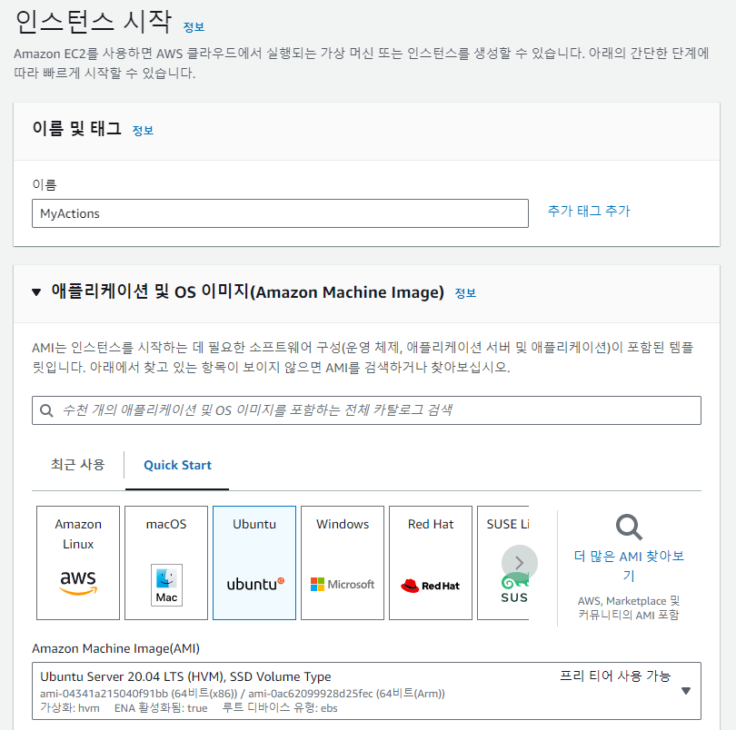
- 키페어 생성후, 보안그룹 설정
- 보안그룹은 사용할 포트번호를 인바운드 시킨다
- 
  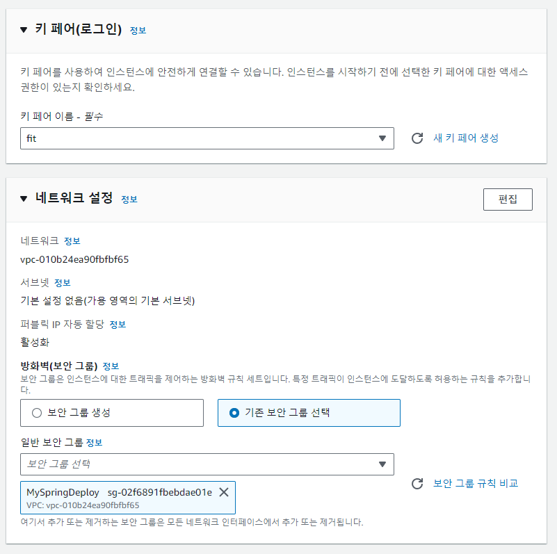


### 2. 깃 레포에 스프링 프로젝트 푸시
- 스프링 프로젝트 생성
- 
  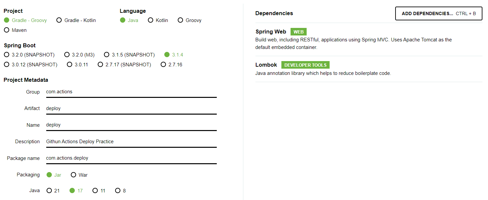
- gitignore에 application.properties 추가
- application.properties에 적힌 값을 출력하는 컨트롤러 추가
  ```java
    package com.actions.deploy;

    import org.springframework.beans.factory.annotation.Value;
    import org.springframework.web.bind.annotation.GetMapping;
    import org.springframework.web.bind.annotation.RestController;

    @RestController
    public class HelloController {

        @Value("${SECRET}")
        private String hello;

        @GetMapping("/")
        public String hello() {
            return hello;
        }
        
    }
  ```
  ```
    SECRET=secret
  ```
- 깃레포 생성 후 spring project push
- application.properties 안올라 갔는지 확인
- 
  


### 3. AWS IAM 사용자 생성
- IAM 검색후 사용자 생성
- 
  
  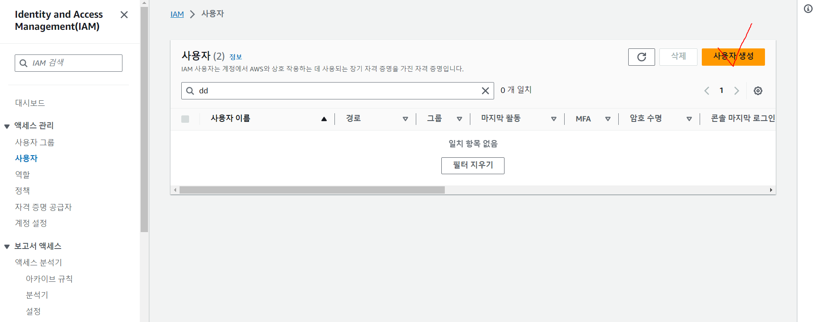
  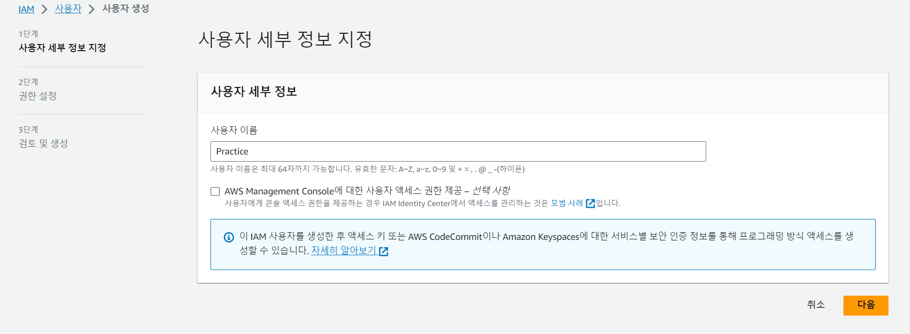

- AmazonEC2FullAccess, AmazonS3FullAccess, AWSCodeDeployFullAccess 권한 설정

  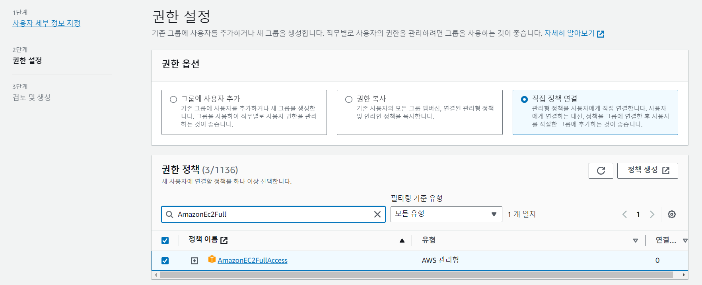
  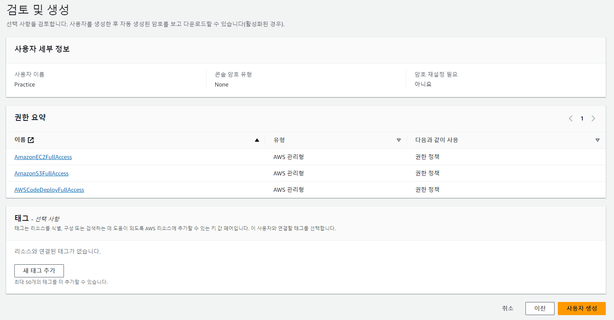

- 사용자 생성후 생성한 사용자 클릭
- 보안 자격 증명 탭에서
- 엑세스 키 발급
- 
  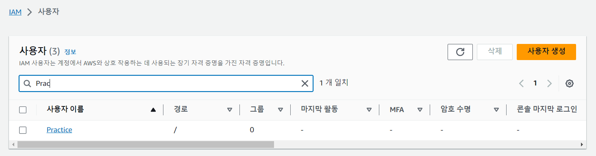
  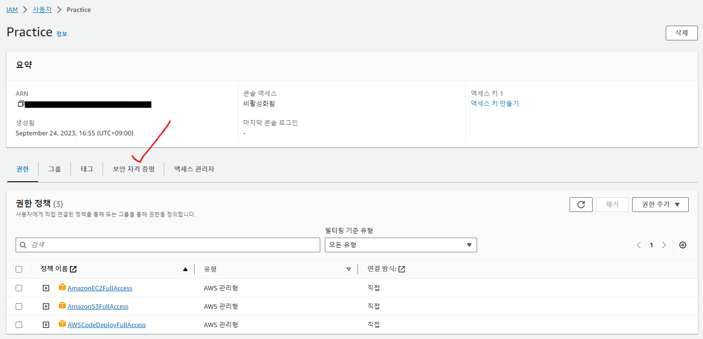
  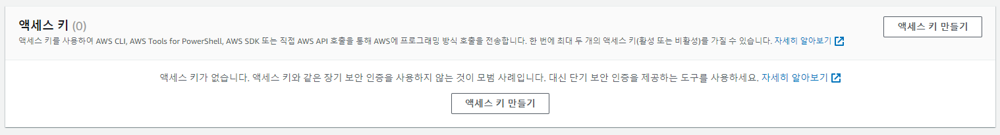
  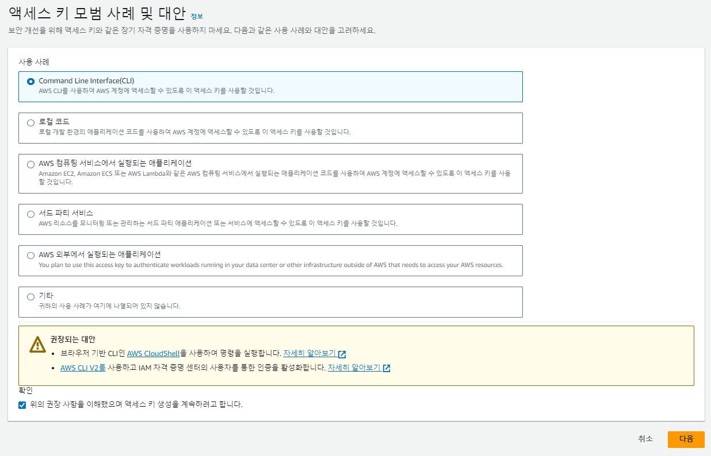
- 엑세스 키는 다시 볼 수 없으므로 다른 곳에 저장하거나 CSV파일 다운 받기, 물론 절대 공개되면 안됨
  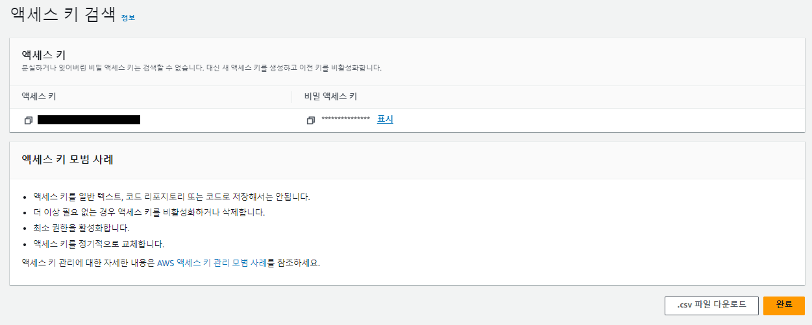


### 4. EC2 역할 생성
- IAM 왼쪽 탭에서 역할 생성 클릭
- 
  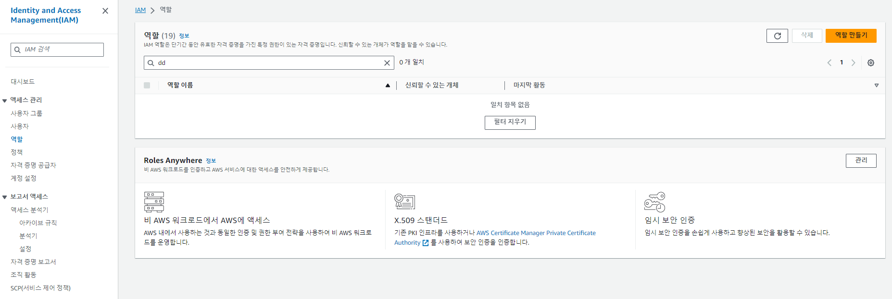
- AWS 서비스선택후 EC2 선택
- 
  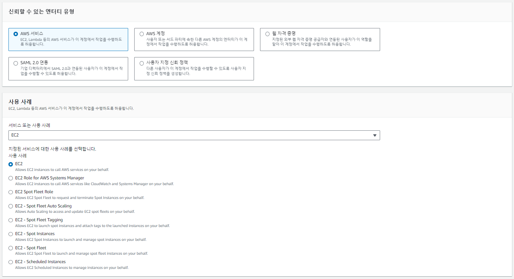
- AmazonEC2FullAccess, AmazonS3FullAccess, AWSCodeDeployFullAccess 권한 설정
- 
  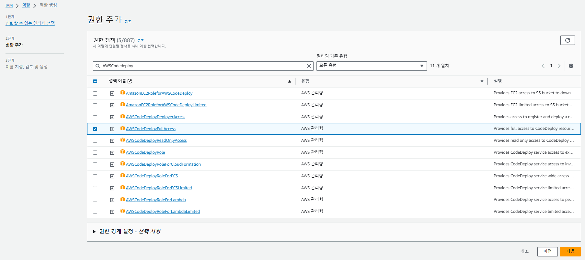


### 5. EC2에 IAM 역할 연결 
- EC2 들어가서 방금 만들 EC2 마우스 오른쪽 클릭
- 보안 -> IAM 역할 수정 클릭
- 
  
- 방금 만든 IAM역할로 업데이트
- 
  


### 6. Code Deploy 역할 생성
- IAM 왼쪽 탭에서 역할 생성 클릭
- 
  
- Code Deploy 엔터디 선택
- 
  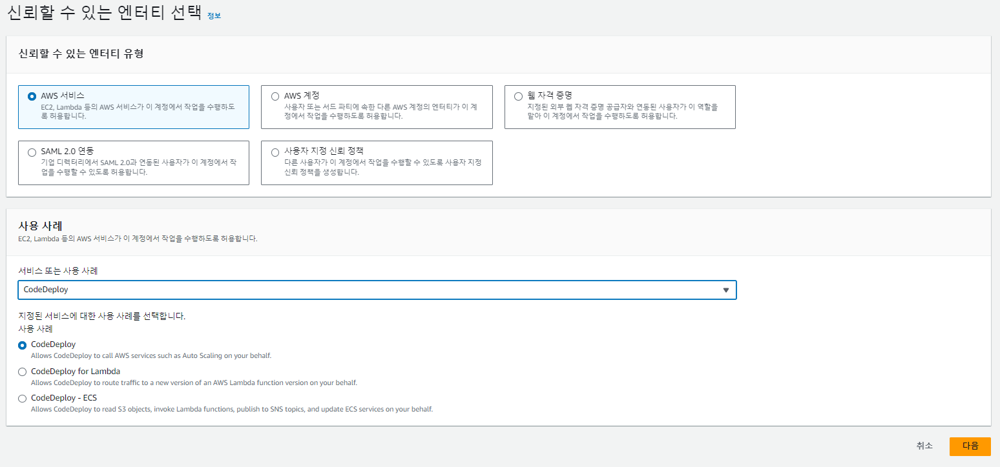
- 기본으로 AWSCodeDeployRole로 되어 있음 다음버튼 클릭
- 
  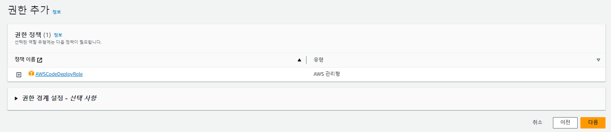
- 이름 지정후 역할 생성
- 
  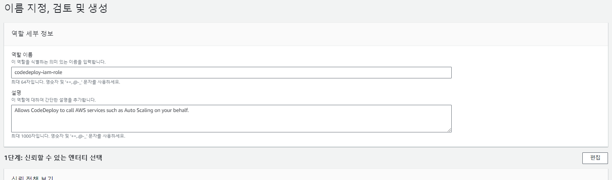


### 7. Code Deploy 생성


## 📌 참조

- https://artist-developer.tistory.com/24
