# 📖 OSI 7 계층 (Open Systems Interconnection 7 Layer)

## 📌 OSI 7 계층이란?

- **네트워크에서 통신이 일어나는 과정**을 7단계로 나눈 것
- 국제 표준화 기구(ISO)에서 개발한 모델

  

## 📌 왜 7 계층으로 나눠야 할까?

- 통신이 일어나는 과정이 꽤 복잡하다.
  - 이 복잡한 과정을 단계별로 파악하여 흐름을한눈에 보기 쉽고, 사람들이 이해하기 쉽다.
  - 특정 문제가 발생했을 때 다른 단계를 수정하지 않고도 이상이 생긴 단계만 수정하여 문제를 해결할 수 있다.

  

## 📌 OSI 7 계층에 대해 자세히 알아보자.

 

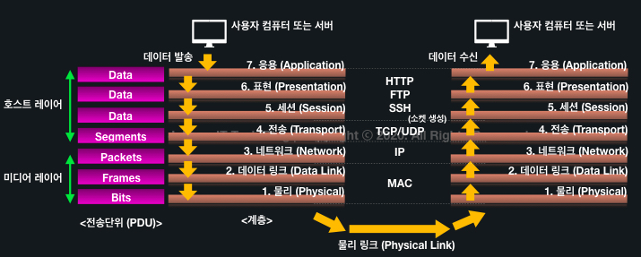

- OSI 7 계층은 위의 그림과 같이, 7단계의 계층들의 순서에 따라 각 계층에서 담당하는 기술과 방식으로 **데이터를 종단에서 반대쪽 종단으로 전달한다.**

 

### ✅ Layer 1 : Physical Layer(물리 계층)

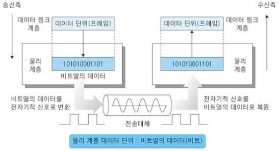

> - 데이터를 전기적 신호로 변환하여 전송하는 계층

 

- 전기, 물리 신호에 대한 계층

 

- `Bit` 단위를 사용
  - 전기적 신호 (0 or 1)을 나타낼 때 사용하는 단위
  - 0과 1은 Off, On를 나타낸다.
  
 

- **단순 전기적 신호를 전달**하는 역할
  - 오류 제어, 알고리즘 등이 없음.
    - 데이터가 무엇인지, 어떤 에러가 있는지는 전혀 신경쓰지 않는다.
    - 단지 데이터를 전기적 신호로 변환하여 주고 받기만 한다.

 

- 송신 : 2 계층(Data Link Layer)로부터 0, 1로 구성된 비트열 데이터(Frame)을 받아 전기적 신호로 변환 후 전송
- 수신 : 전기적 신호를 0, 1로 구성된 비트로 복원하여 2 계층(Data Link Layer)로 전송

 

- 통신 단위
  - **비트(Bit)**

- 대표 장비 : 랜 케이블, 허브, 리피터, 전선, 광케이블, 동축케이블, 무선 전파, PSTN, DSU, CSU, 모뎀 등

  

### ✅ Layer 2 : Data Link Layer(데이터 링크 계층)

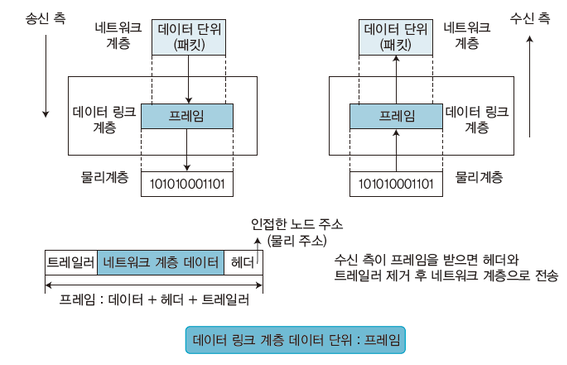

> - Physical Layer로 송수신되는 정보를 관리하여 안전하게 전달되도록 돕는 계층
> - Mac 주소를 통해 통신
> - Frame에 MAC 주소를 부여하고, 에러 검출 / 재전송 / 흐름 제어를 진행한다.

 

- 1계층(Physical Layer)을 통해 송수신되는 정보의 오류와 흐름을 관리하여 안전한 정보의 전달을 수행하도록 도와준다.
  - 과도한 양의 데이터가 한번에 전송되지 않도록, 데이터의 양을 조절한다.
  - 데이터의 오류를 검출하고 복구하는 오류 제어 / 흐름 제어를 수행한다.

 

- 1~3 계층에서는 **논리 주소(ex> IP 주소)가 아닌 물리 주소(ex> MAC 주소)**를 참조하여 각 장비별 데이터 전송을 수행한다.
  - - 1 계층(Physical Layer)에서 발생할 수 있는 **오류를 찾고 수정**하는데 필요한 기능 / 절차를 제공한다.

 

- Data Link Layer의 흐름
  - **물리적 주소**를 지정한다. (ex> MAC 주소)
  - **전송 데이터(비트 모음)의 헤더에 목적지 주소**를 붙인다.
  - **꼬리 부분에 오류 검출**을 위한 부분이 존재한다.
  - 이 처럼 Data Link Layer에서 데이터를 **프레임(Frame)**이라고 한다.
    - Data Link Layer의 데이터 단위 : 프레임(Frame)
  - **프레임의 구성요소**
    - Header : MAC 주소 (물리적 주소)
    - Data : 4계층(Transport Layer)의 Header와 Packet
    - Trailer :  오류 검출을 위해 사용
      - FCS(Frame Check Sequence, 프레임 체크 문자열)
      - CRC(Cyclick Redundancy Check, 순환 중복 검사)

 

- 포인트 투 포인트(Point to Point)간 신뢰성 있는 전송을 보장하기 위해 CRC 기반 오류 제어와 흐름 제어가 필요하다.
  - 네트워크 위의 개체들 간 데이터를 전달
  - 1계층 (Physical Layer)에서 발생할 수 있는 오류를 찾고 수정하는데 필요한 기능적, 절차적 수단 제공

 

- Data Link Layer의 부계층
  - LLC(Logical Link Control, 논리적 연결 제어) : Data Link Layer의 기본 기능을 다룬다.
  - MAC(Media Access Control, 매체 접근 제어) : 물리적 전송 선로의 특징과 매체 간 연결 방식에 따른 제어 부분 처리

 

- 통신 단위
  - **프레임(Frame)**

- 대표 장비
  - 브릿지, 스위치(L2 Switch) 등
- 대표 프로토콜 / 기술 
  - MAC(물리적 주소), PPP(Point to Point Protocol) 등

  

### ✅ Layer 3 : Network Layer(네트워크 계층)

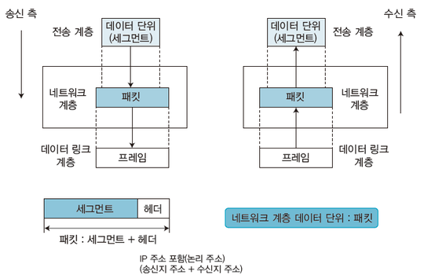

> - 데이터를 목적지까지 가장 안전하고 빠르게 전달하는 기능 담당
> - 라우터를 통해 이동할 경로를 선택하여 IP 주소를 지정하고, 해당 경로에 따라 패킷을 전달
> - 라우팅, 흐름 제어, 오류 제어, 세그먼테이션 수행

 

- **데이터를 목적지까지 가장 안전하고 빠르게 전달**하는 기능 (Routing, 라우팅)
- **경로를 선택하고 주소를 정하고 경로에 따라 패킷을 전달**
- 다양한 길이의 데이터를 네트워크들을 통해 전달하고, 그 과정에서 전송 계층이 요구하는 서비스 품질(QoS)을 제공하기 위한 기능적, 절차적 수단 제공

 

- 데이터를 연결하는 다른 네트워크를 통해 전달함으로써 인터넷이 가능하게 만드는 계층
- IP(논리적 주소 구조, 네트워크 관리자가 직접 주소를 할당하는 구조), 계층적(hierarchical)
- 계층 사이에 네트워크 서비스 데이터 유닛(NSDU : Network Service Data Unit)을 교환하는 기능 제공

 

- 라우팅, 흐름 제어, 세그멘테이션, 오류 제어, 인터네트워킹 등 수행
  - 라우팅 : 패킷 전달을 위해 할당된 IP 주소를 기반으로 네트워크를 구분

 

- 통신 단위
  - **패킷(Packet)**

- 대표 장비
  - 라우터, Layer3 스위치(IP 주소 사용)

  

### ✅ Layer 4 : Transport Layer(전송 계층)

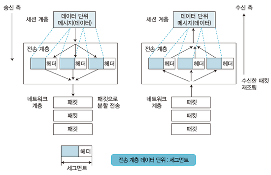

> - TCP, UDP 프로토콜을 통해 통신을 활성화
> - 포트를 열고, 프로그램들이 전송할 수 있도록 제공

 

- 통신을 활성화하기 위한 계층
  - 보통 **TCP 프로토콜** 이용
  - 포트를 열어 응용 프로그램들이 전송할 수 있도록 한다.

- 양 끝단의 사용자들이 **신뢰성 있는 데이터를 주고받을 수 있게** 해준다.
  - 상위 계층이 데이터 전달의 유효성이나 효율성을 생각하지 않도록 해준다.

 

- 각 종단 간 데이터 전송에 대한 전반적 조율 담당
  - 통신의 신뢰성 보장

 

- Segmentation : 쪼개진 데이터 유닛인 `세그먼트(Segment)`를 포트 번호 등으로 구분하여 각 응용 계층이 나눠 받도록 하는 분할작업
- Flow Control(흐름 제어) : 서로 다른 장비 간 각기 다른 대역폭 속도를 맞춤
- Error Control(오류 제어) : 수신하지 못한 세그먼트가 존재할 때 해당 부분만 다시 송신을 요청
- Connection-oriendted(연결형) :  데이터 수신 유/무 확인
  - 전송이 유효한지 확인하고 전송 실패한 패킷들을 재전송 한다는 뜻
- Connectionless(비연결형) : 데이터 수신 유/무 확인

 

- 통신 단위
  - **세그먼트(Segment)**

- 대표 장비
  - 게이트웨이
- 프로토콜
  - TCP : 연결성 데이터 전송 프로토콜
    - 데이터 전송 시 신뢰성 높은 데이터 전송
    - 3 Way-HandShaking 작업 수행
  - UDP : 비연결성 데이터 전송 프로토콜
    - 데이터 전송을 할 시 신뢰성이 낮은 대신 빠른 전송 제공

  

### ✅ Layer 5 : Session Layer(세션 계층)

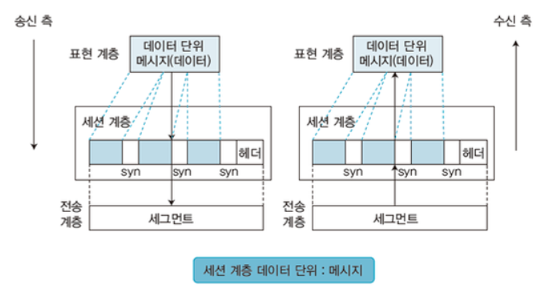

> - 데이터가 통신하기 위한 논리적 연결 담당
> - TCP/IP 세션을 만들고 없애는 책임을 가짐

 

- 데이터가 서로 만나는 환경을 조성
  - 권한 인증/인가
- 4계층(Transport Layer)과 무관하게 응용프로그램 관점에서 봐야 한다.

 

- 기능
  - 세션 설정
  - 세션 유지
  - 세션 종료
  - 전송 중단 시 복구

 

- 양 끝단의 응용 프로세스가 통신을 관리하기 위한 방법 제공
  - duplex(동시 송수신 방식)
  - half-duplex(반이중 방식)
  - full duplex(전이중 방식)
- **TCP/IP 세션을 만들고 없애는 책임**

 

- 통신하는 사용자들을 동기화하고, 오류복구 명령을 일괄적으로 다룸.
- 통신을 위한 세션 확립/유지/중단(OS가 해줌)

 

- 통신 단위
  - **메시지**
- 프로토콜
  - SSH : 원격 컴퓨터에 안전하게 액세스 하기 위한 프로토콜
  - TLS : 암호화 보안 프로토콜

  

### ✅ Layer 6 : Presentation Layer(표현 계층)

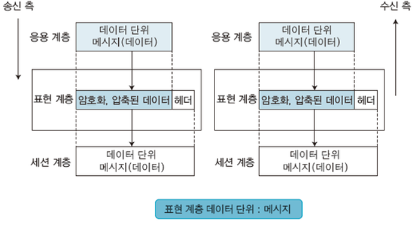

> - 데이터 표현에 대한 독립성을 제공하고 암호화하는 역할을 담당
> - 파일 인코딩, 명령어를 포장, 압축, 암호화

 

- **데이터를 더 빠르고 안전하게 전송하기 위해 압축 / 암호화 / 복호화 작업 수행**
  - 데이터 표현이 상이한 응용 프로세스의 독립성을 제공하고 암호화

- 코드 간 번역을 담당하여 사용자 시스템에서 데이터의 형식상 차이를 다루는 부담을 7계층(Application Layer)으로부터 덜어줌.

 

- 통신단위
  - **메시지**
- 프로토콜
  - SSL
  - JPEG
  - MPEG
  - SMB

  

### ✅ Layer 7 : Application Layer(응용 계층)

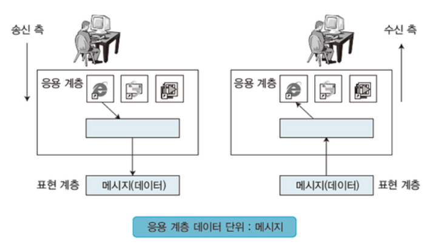

> - 최종 목적지로서, 응용 프로세스와 직접 관계하여 일반적인 응용 서비스 수행
> - 사용자 인터페이스, 전자우편, DB 관리 등의 서비스 제공

 

- 도착한 데이터를 최종 사용자가 확인하는 마지막 단계
- 브라우저, 메일 등 네트워크를 활용하는 다양한 응용 프로그램들이 포함된다.
- **응용 프로세스와 직접 관계하여 일반적인 응용 서비스를 수행**한다.

 

- 통신단위
  - **메시지**
- 프로토콜
  - DHCP
  - DNS
  - FTP
  - HTTP

  

## 📌 OSI 7 계층의 계층간 관계

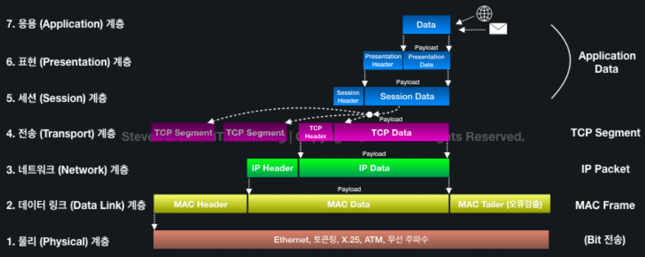

- OSI 7 계층에서 데이터를 전송할 때 각 층마다 별도로 인식할 수 있는 헤더를 각각 붙이게 되는데, 이 과정을 캡슐화 라고 한다.(Encapsulation)
  - 반대로 헤더가 벗겨지는 것을 디캡슐화(De-encapsulation)

 

- 각 계층은 아래 계층의 데이터가 된다.
  - 직전 계층으로부터 내려오는 부분을 Payload라고 부른다.
  - 각 계층마다 요청(Request) / 응답(Response)의 상호작용을 수행하기에, 이는 Server / Client 관계라고도 볼 수 있다.

 

- PDU(Process Data Unit) : 각 계층에서 데이터 단위를 구분

  

## 📌 TCP/IP 4 계층

### ✅ TCP/IP 4 계층이란?

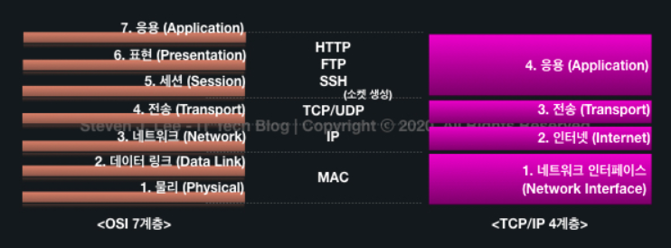

 

- 인터넷에서 대부분은 IP 기반의 TCP 통신으로 이루어진다.
  - 이에 TCP/IP 통신을 기준으로 만든 것이 TCP/IP 4 계층이다. (Internet Protocol Sweet라고도 부른다.)

but > **TCP/IP 4 계층 모델은 OSI 7 계층 모델의 진화한 모델이 아니라, 서로 다른 모델로 인식해야 한다.**

  

### ✅ Layer 1 : Network Layer(네트워크 계층)

- OSI 7계층의 Physical Layer와 Data Link Layer에 해당한다.
- **물리적인 TCP/IP 패킷의 전달 및 수신 과정 담당**

  

### ✅ Layer 2 : Internet Layer(인터넷 계층)

- OSI 7 계층에서 Network Layer와 대응되는 계층
- 패킷을 목적지까지 효율적으로 전달하는 것만 고려
- 논리적 주소인 IP 주소를 판독하고 **목적지의 네트워크를 찾아가 목적지에 잘 도착하도록 전송**

  

### ✅ Layer 3 : Transport Layer(전송 계층)

- OSI 7 계층의 Transport Layer와 동일한 역할
- **전달되는 패킷의 오류를 검사하고 전반적인 제어를 담당**

  

### ✅ Layer 4 : Application Layer(응용 계층)

- OSI 7 계층에서 Session Layer, Presentation Layer, Application Layer의 역할들에 해당
- **사용자의 응용 프로그램 레벨에서 데이터를 처리하는 계층(하위 계층으로부터 받은 메시지를 변환하거나, 하위 계층으로 메시지를 전달)**

  

## 📌 OSI 7 계층 vs TCP/IP 4 계층

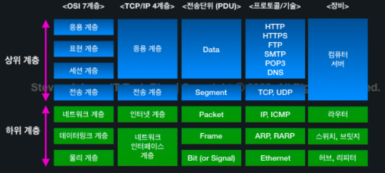

  

## 📌 계층 모델의 장점

- 데이터 흐름이 한눈에 보인다.
- 표준화된 규칙을 기반으로 하여, 다른 제조사의 장비 끼리도 통신이 가능(호환성 보장)
- 계층 단계별로 체크가 가능하여, 장애 처리가 쉽다.
- 다른 계층의 전달 과정을 알 필요가 없이, 자신의 계층에만 집중하면 된다.
  - 캡슐화와 은닉이 가능해진다.
- 대부분의 업계인들이 알고 있고, 사용하는 방식이기에 소통이 편하다.

  

## 📚 출처

- https://gyoogle.dev/blog/computer-science/network/OSI%207%EA%B3%84%EC%B8%B5.html
- https://shlee0882.tistory.com/110
- https://www.stevenjlee.net/2020/02/09/%EC%9D%B4%ED%95%B4%ED%95%98%EA%B8%B0-osi-7%EA%B3%84%EC%B8%B5-%EA%B7%B8%EB%A6%AC%EA%B3%A0-tcp-ip-4%EA%B3%84%EC%B8%B5/
- https://m.blog.naver.com/PostView.naver?isHttpsRedirect=true&blogId=kyg3766&logNo=220691506863
- https://m.blog.naver.com/kyg3766/220691524213
- https://m.blog.naver.com/kyg3766/220691563209
- https://m.blog.naver.com/kyg3766/220694266577
- https://m.blog.naver.com/kyg3766/220694297437
- https://m.blog.naver.com/kyg3766/220694305970
- https://m.blog.naver.com/kyg3766/220694313116

  