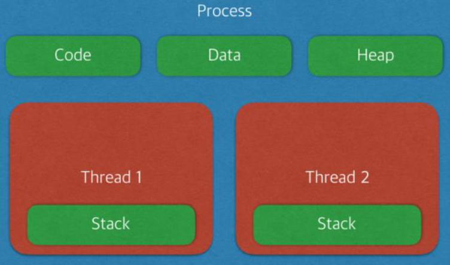
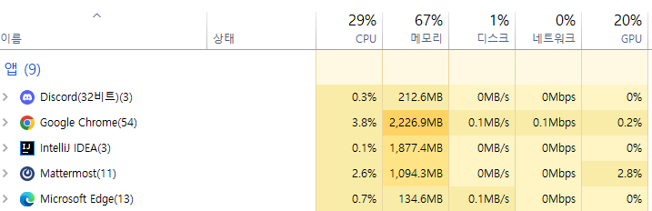

### 2023.09.10

## 운영체제 (Operating System)

### 1. 프로세스와 쓰레드
- 프로세스 : 프로그램을 메모리 상에서 실행중인 작업
- 쓰레드 : 프로세스 안에서 실행되는 여러 흐름 단위
  
  

### 2. 주소공간 할당
- Code : 코드 자체를 구성하는 메모리 영역(프로그램 명령)
- Data : 전역변수, 정벽변수, 배열
  - 초기화된 데이터는 data 영역에 저장
  - 초기화되지 않은 데이터는 bss 영역에 저장
- Heap : 동적 할당시 사용 (new(), malloc() 등)
- Stack : 지역변수, 매개변수, 리턴 값

### 3. 프로세스 vs 쓰레드
- 쓰레드는 stack만 따로 할당을 받고 나머지 영역은 서로 공유  
- 하나의 프로세스가 생성될 때, 기본적으로 하나의 쓰레드 같이 생성
- 프로세스는 자신만의 고유 공간과 자원을 할당받아 사용한다
  - 다른 프로세스에 접근 하려면 프로세스 간의 통신(IPC, Inter-Process-Communcation)을 사용해야한다.
- 쓰레드는 다른 쓰레드와 공간, 자원을 공유하면서 사용한다.

  
- Discord, Chrome은 각각의 프로세스이며 이를 실행하는 작업의 요청 단위가 쓰레드이다.
- Discoed와 Chrome은 서로의 변수나 자료구조에 접근 할 수 없다.

### 4. 멀티 프로세스
- 하나의 프로그램을 여러개의 프로세스로 구성하여 각 프로세스가 병렬적으로 작업을 수행하는 것
- 장점 : 안전성(메모리 침범 문제를 OS차원에서 해결)
- 단점 : 각각 독립된 메모리 영역을 갖고 있어, 작업량 많을 수록 오버헤드 발생. Context Switching으로 인한 성능 저하
    
**Context Switching 이란?**
- 프로세스의 상태 정보를 저장하고 복원하는 일련의 과정
- 동작중인 프로세스가 대기하면서 해당 프로세스의 상태를 보관하고, 대기하고 있던 다음 순번의 프로세스가 동작하면서 이전에 보관했던 프로세스 상태를 복구하는 과정

### 5. 멀티 쓰레드
- 하나의 응용 프로그램에서 여러 스레드를 구성해 각 스레드가 하나의 작업을 처리하는 것
- 쓰레드들이 공유 메모리를 통해 다수의 작업을 동시에 처리하도록 해줌
- 공유자원에 대한 문제